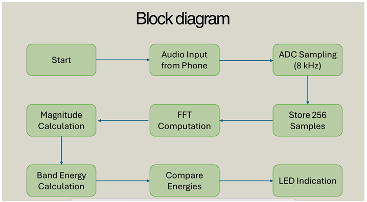

# 🎵 Real-Time Audio Frequency Band Detection using TMS320C6713 DSP

> 256-point Radix-2 Decimation-in-Time (DIT) FFT implementation achieving 31.25 Hz frequency resolution on a floating-point DSP processor.

---

---

## 🛠 Technologies Used

- Embedded C
- TMS320C6713 Floating-Point DSP
- AIC23 Audio Codec
- Code Composer Studio (CCS)
- Radix-2 DIT FFT Algorithm
- McBSP Serial Interface

---

## ⚙ System Specifications

- **Sampling Rate:** 8 kHz  
- **FFT Size:** 256 points  
- **Frequency Resolution:** 31.25 Hz (Fs/N)  
- **Processor:** TMS320C6713 Floating-Point DSP  

---

## 📂 Files in the Project

- `main.c` – Complete FFT implementation with energy-based band classification  
- `image.png` – System block diagram  
- `DSP report-1.pdf` – Detailed technical project documentation  

---

## 🧠 Working Principle

1. Audio signal is sampled at 8 kHz using the AIC23 codec.
2. 256 time-domain samples are buffered.
3. Bit-reversal reordering is applied.
4. 256-point Radix-2 DIT FFT converts the signal to frequency domain.
5. Magnitude spectrum is computed.
6. Band energies are calculated for:
   - Low (<300 Hz)
   - Mid (300–2000 Hz)
   - High (>2000 Hz)
7. The dominant frequency band activates the corresponding onboard LED.

---

## ▶ How to Run

1. Connect an audio source to the Line-In port of the DSP board.
2. Open the project in Code Composer Studio (CCS).
3. Build and load the program onto the DSP.
4. Run the application.
5. Observe LED indication corresponding to dominant frequency band.

---

## 📌 Applications

- Baby Cry Detection System
- Real-Time Audio Spectrum Analyzer
- Sound Monitoring and Classification
- Embedded Signal Processing Demonstration

---

## 🚀 Future Improvements

- Apply Hamming window prior to FFT to reduce spectral leakage
- Implement interrupt-driven sampling instead of polling
- Integrate ML-based sound classification
- Add wireless alert/notification system
